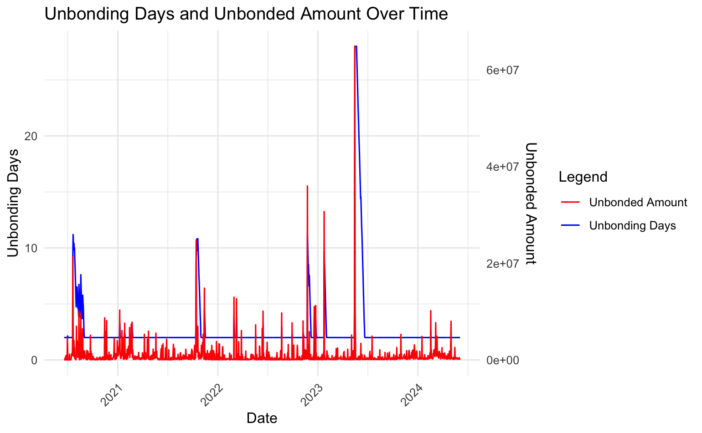

# RFC-0092: Unbonding Queue

|                 |                                                                                             |
| --------------- | ------------------------------------------------------------------------------------------- |
| **Date**  | 19.06.2024                                                                                  |
| **Description** | This RFC proposes a safe mechanism to scale the unbonding time from staking on the Relay Chain proportionally to the overall unbonding stake. This approach significantly reduces the expected duration for unbonding, while ensuring that a substantial portion of the stake is always available to slash of validators behaving maliciously within a 28-day window.                                                                                                            |
| **Authors**     |    Jonas Gehrlein & Alistair Stewart                                                                                                         |

## Summary

This RFC proposes a flexible unbonding mechanism for tokens that are locked from [staking](https://wiki.polkadot.network/docs/learn-staking) on the Relay Chain (DOT/KSM), aiming to enhance user convenience without compromising system security. 

Locking tokens for staking ensures that Polkadot is able to slash tokens backing misbehaving validators. With changing the locking period, we still need to make sure that Polkadot can slash enough tokens to deter misbehaviour. This means that not all tokens can be unbonded immediately, however we can still allow some tokens to be unbonded quickly.

The new mechanism leads to a signficantly reduced unbonding time on average, by queuing up new unbonding requests and scaling their unbonding duration relative to the size of the queue. New requests are executed with a minimum of 2 days, when the queue is comparatively empty, to the conventional 28 days, if the sum of requests (in terms of stake) exceed some threshold. In scenarios between these two bounds, the unbonding duration scales proportionately. The new mechanism will never be worse than the current fixed 28 days.  

In this document we also present an empirical analysis by retrospectively fitting the proposed mechanism to the historic unbonding timeline and show that the average unbonding duration would drastically reduce, while still being sensitive to large unbonding events. Additionally, we discuss implications for UI, UX, and conviction voting.

Note: Our proposition solely focuses on the locks imposed from staking. Other locks, such as governance, remain unchanged. Also, this mechanism should not be confused with the already existing feature of [FastUnstake](https://wiki.polkadot.network/docs/learn-staking#fast-unstake), which lets users unstake tokens immediately that have not received rewards for 28 days or longer.

As an initial step to gauge its effectiveness and stability, it is recommended to implement and test this model on Kusama before considering its integration into Polkadot, with appropriate adjustments to the parameters. In the following, however, we limit our discussion to Polkadot.

## Motivation

Polkadot has one of the longest unbonding periods among all Proof-of-Stake protocols, because security was the most important goal. Staking on Polkadot is still attractive compared to other protocols because of its above-average staking APY. However the long unbonding period harms usability and deters potential participants that want to contribute to the security of the network. 

The current length of the unbonding period imposes significant costs for any entity that even wants to perform basic tasks such as a reorganization / consolidation of their stashes, or updating their private key infrastructure. It also limits participation of users that have a large preference for liquidity.

The combination of long unbonding periods and high returns has lead to the proliferation of [liquid staking](https://www.bitcoinsuisse.com/learn/what-is-liquid-staking), where parachains or centralised exchanges offer users their staked tokens before the 28 days unbonding period is over either in original DOT/KSM form or derivative tokens. Liquid staking is harmless if few tokens are involved but it could result in many validators being selected by a few entities if a large fraction of DOTs were involved. This may lead to centralization (see [here](https://dexola.medium.com/is-ethereum-about-to-get-crushed-by-liquid-staking-30652df9ec46) for more discussion on threats of liquid staking) and an opportunity for attacks.  

The new mechanism greatly increases the competitiveness of Polkadot, while maintaining sufficient security.


## Stakeholders

- Every DOT/KSM token holder

## Explanation

Before diving into the details of how to implement the unbonding queue, we give readers context about why Polkadot has a 28-day unbonding period in the first place. The reason for it is to prevent long-range attacks (LRA) that becomes theoretically possible if more than 1/3 of validators collude. In essence, a LRA describes the inability of users, who disconnect from the consensus at time t0 and reconnects later, to realize that validators which were legitimate at a certain time, say t0 but dropped out in the meantime, are not to be trusted anymore. That means, for example, a user syncing the state could be fooled by trusting validators that fell outside the active set of validators after t0, and are building a competitive and malicious chain (fork). 

LRAs of longer than 28 days are mitigated by the use of trusted checkpoints, which are assumed to be no more than 28 days old. A new node that syncs Polkadot will start at the checkpoint and look for proofs of finality of later blocks, signed by 2/3 of the validators. In an LRA fork, some of the validator sets may be different but only if 2/3 of  some validator set in the last 28 days signed something incorrect. 

If we detect an LRA of no more than 28 days with the current unbonding period, then we should be able to detect misbehaviour from over 1/3 of validators whose nominators are still bonded. The stake backing these validators is considerable fraction of the total stake (empirically it is 0.287 or so). If we allowed more than this stake to unbond, without checking who it was backing, then the LRA attack might be free of cost for an attacker. The proposed mechansim allows up to half this stake to unbond with in 28 days. This halves the amount of tokens that can be slashed, but this is still very high in absolute terms. For example, at the time of writing (19.06.2024) this would translate to around 120 millions DOTs.

Attacks other than an LRA, such as backing incorrect parachain blocks, should be detected and slashed within 2 days. This is why the mechanism has a minimum unbonding period.

In practice an LRA does not affect clients who follow consensus more frequently than every 2 days, such as running nodes or bridges. However any time a node syncs Polkadot if an attacker is able to connect to it first, it could be misled.

In short, in the light of the huge benefits obtained, we are fine by only keeping a fraction of the total stake of validators slashable against LRAs at any given time.

## Mechanism

When a user ([nominator](https://wiki.polkadot.network/docs/learn-nominator) or validator) decides to unbond their tokens, they don't become instantly available. Instead, they enter an *unbonding queue*. The following specification illustrates how the queue works, given a user wants to unbond some portion of their stake denoted as `new_unbonding_stake`. We also store a variable, `max_unstake` that tracks how much stake we allow to unbond potentially earlier than 28 eras (28 days on Polkadot and 7 days on Kusama).

To calculate `max_unstake`, we record for each era how much stake was used to back the lowest-backed 1/3 of validators. We store this information for the last 28 eras and let `min_lowest_third_stake` be the minimum of this over the last 28 eras.
`max_unstake` is determined by `MIN_SLASHABLE_SHARE` x `min_lowest_third_stake`. In addition, we can use `UPPER_BOUND` and `LOWER_BOUND` as variables to scale the unbonding duration of the queue.

At any time we store `back_of_unbonding_queue_block_number` which expresses the block number when all the existing unbonders have unbonded.

Let's assume a user wants to unbond some of their stake, i.e., `new_unbonding_stake`, and issues the request at some arbitrary block number denoted as `current_block`. Then:

```
unbonding_time_delta = new_unbonding_stake / max_unstake * UPPER_BOUND
```

This number needs to be added to the `back_of_unbonding_queue_block_number` under the conditions that it does not undercut`current_block + LOWER_BOUND` or exceed `current_block + UPPER_BOUND`. 

```
back_of_unbonding_queue_block_number = max(current_block_number, back_of_unbonding_queue_block_number) + unbonding_time_delta
```

This determines at which block the user has their tokens unbonded, making sure that it is in the limit of `LOWER_BOUND` and `UPPER_BOUND`.

```
unbonding_block_number = min(UPPER_BOUND, max(back_of_unbonding_queue_block_number - current_block_number, LOWER_BOUND)) + current_block_number
```

Ultimately, the user's token are unbonded at `unbonding_block_number`.

### Proposed Parameters
There are a few constants to be exogenously set. They are up for discussion, but we make the following recommendation:
- `MIN_SLASHABLE_SHARE`: `1/2` - This is the share of stake backing the lowest 1/3 of validators that is slashable at any point in time. It offers a trade-off between security and unbonding time. Half is a sensable choice. Here, we have sufficient stake to slash while allowing for a short average unbonding time.
- `LOWER_BOUND`: 28800 blocks (or 2 eras): This value resembles a minimum unbonding time for any stake of 2 days. 
- `UPPER_BOUND`: 403200 blocks (or 28 eras): This value resembles the maximum time a user faces in their unbonding time. It equals to the current unbonding time and should be familiar to users.

### Rebonding

Users that chose to unbond might want to cancel their request and rebond. There is no security loss in doing this, but with the scheme above, it could imply that a large unbond increases the unbonding time for everyone else later in the queue. When the large stake is rebonded, however, the participants later in the queue move forward and can unbond more quickly than originally estimated. It would require an additional extrinsic by the user though.

Thus, we should store the `unbonding_time_delta` with the unbonding account. If it rebonds when it is still unbonding, then this value should be subtracted from `back_of_unbonding_queue_block_number`. So unbonding and rebonding leaves this number unaffected. Note that we must store `unbonding_time_delta`, because in later eras `max_unstake` might have changed and we cannot recompute it.


### Empirical Analysis
We can use the proposed unbonding queue calculation, with the recommended parameters, and simulate the queue over the course of Polkadot's unbonding history. Instead of doing the analysis on a per-block basis, we calculate it on a daily basis. To simulate the unbonding queue, we require the ratio between the daily total stake of the lowest third backed validators and the daily total stake (which determines the `max_unstake`) and the sum of daily and newly unbonded tokens. Due to the [NPoS algorithm](https://wiki.polkadot.network/docs/learn-phragmen), the first number has only small variations and we used a constant as approximation (0.287) determined by sampling a bunch of empirical eras. At this point, we want to thank Parity's Data team for allowing us to leverage their data infrastructure in these analyses.

The following graph plots said statistics.



The abovementioned graph combines two metrics into a single graph. 
- `Unbonded Amount`: The number of daily and newly unbonded token over time scaled to the y-axis of 28 days. In particular its normalized by `daily_unbonded / max(daily_unbonded) * 28`.
- `Unbonding Days`: The daily expected unbonding days given the history of `daily_unbonded`.

We can observe that historical unbonds only trigger an unbonding time larger than `LOWER_BOUND` in situations with extensive and/or clustered unbonding amounts. The average unbonding time across the whole timeseries is ~2.67 days. We can, however, see it taking effect pushing unbonding times up during large unbonding events. In the largest events, we hit a maximum of 28 days. This gives us reassurance that it is sufficiently sensitive and it makes sense to match the `UPPER_BOUND` with the historically largest unbonds. 

The main parameter affecting the situation is the `max_unstake`. The relationship is obvious: decreasing the `max_unstake` makes the queue more sensitive, i.e., having it spike more quickly and higher with unbonding events. Given that these events historically were mostly associated with parachain auctions, we can assume that, in the absence of major systemic events, users will experience drastically reduced unbonding times.
The analysis can be reproduced or changed to other parameters using [this repository](https://github.com/jonasW3F/unbonding_queue_analysis).


## Additional Considerations

### UX/UI
As per the nature of the unbonding queue, the more a user slices up their stake to be unbonded, the quicker they find their expected unbonding time. This, however, comes at the cost of creating more and/or larger transactions, i.e., incurring higher transactions costs. We leave it to UI implementations to provide a good UX to inform users about this trade-off and help them find their individual willingness to pay to unbond even faster. For most users, splitting up their stake will not lead to any meaningful advantage because their effect on the queue is neglible.

### Conviction voting
Changing the (expected) unbonding period has an indirect impact on conviction voting, because the governance locks do not stack with the staking locks. In other words, if a user is already being locked in staking, they can, for free, choose a conviction vote that is lower or equal to that locking time. Currently and with an unbonding period of a fixed 28 days, that means, the `3x` conviction vote comes essentially for free. There has been discussions to [rescale the conviction weights](https://github.com/polkadot-fellows/RFCs/pull/20#issuecomment-1673553108) to improved parametrization. But, the transition between the old locks and new locks pose significant challenges. 

**We argue, that under our unbonding queue, the current conviction voting scheme logically better aligns with their impact on governance, avoiding an expensive solution to migrate existing locks to a new scheme.** For example, if the average unbonding period is around 2 days from staking, locking tokens for an additional 26 days justifies a higher weight (in that regard of`3x`). Voters that seek maximum liquidity are free to do so but it is fair to be weighted less in governance decisions that are naturally affecting the long-term success of Polkadot.

### Potential Extension
In addition to a simple queue, we could add a market component that lets users always unbond from staking at the minimum possible waiting time)(== `LOWER_BOUND`, e.g., 2 days), by paying a variable fee. To achieve this, it is reasonable to split the total unbonding capacity into two chunks, with the first capacity for the simple queue and the remaining capacity for the fee-based unbonding. By doing so, we allow users to choose whether they want the quickest unbond and paying a dynamic fee or join the simple queue. Setting a capacity restriction for both queues enables us to guarantee a predictable unbonding time in the simple queue, while allowing users with the respective willingness to pay to get out even earlier. The fees are dynamically adjusted and are proportional to the unbonding stake (and thereby expressed in a percentage of the requested unbonding stake). In contrast to a unified queue, this prevents the issue that users paying a fee jump in front of other users not paying a fee, pushing their unbonding time back (which would be bad for UX). The revenue generated could be burned.

This extension and further specifications are left out of this RFC, because it adds further complexity and the empirical analysis above suggests that average unbonding times will already be close the `LOWER_BOUND`, making a more complex design unnecessary. We advise to first implement the discussed mechanism and assess after some experience whether an extension is desirable.

## Drawbacks

- **Lower security for LRAs:** Without a doubt, the theoretical security against LRAs decreases. But, as we argue, the attack is still costly enough to deter attacks and the attack is sufficiently theoretical. Here, the benefits outweigh the costs.
- **Griefing attacks:** A large holder could pretend to unbond a large amount of their tokens to prevent other users to exit the network earlier. This would, however be costly due to the fact that the holder loses out on staking rewards. The larger the impact on the queue, the higher the costs. In any case it must be noted that the `UPPER_BOUND` is still 28 days, which means that nominators are never left with a longer unbonding period than currently. There is not enough gain for the attacker to endure this cost.
- **Challenge for Custodians and Liquid Staking Providers**: Changing the unbonding time, especially making it flexible, requires entities that offer staking derivatives to rethink and rework their products.

## Testing, Security, and Privacy

NA

## Performance, Ergonomics, and Compatibility

NA

### Performance

The authors cannot see any potential impact on performance.

### Ergonomics

The authors cannot see any potential impact on ergonomics for developers. We discussed potential impact on UX/UI for users above.

### Compatibility

The authors cannot see any potential impact on compatibility. This should be assessed by the technical fellows.


### Prior Art and References
- Ethereum proposed a [similar solution](https://blog.stake.fish/ethereum-staking-all-you-need-to-know-about-the-validator-queue/)
- Alistair did some initial [write-up](https://hackmd.io/SpzFSNeXQM6YScW1iODC_A)
- There are [other solutions](https://arxiv.org/pdf/2208.05408.pdf) that further mitigate the risk of LRAs.

### The Unresolved Question: Deferred slashing

Currently we defer applying many slashes until 28 days have passed. This was implemented so we can conveniently cancel slashes via governance in the case that the slashing was due to a bug. While rare on Polkadot, such bugs cause a significant fraction of slashes. This includes slashing for attacks other than LRAs for which we've assumed that 2 days is enough to slash. But 2 days in not enough to cancel slashes via OpenGov.

Owing to the way exposures, which nominators back validators with how many tokens, are stored, it is hard to search for whether a nominator has deferred slashes that need to be applied to them on chain. So we cannot simply check when a nominator attempts to withdraw their bond.

One option would be to allow any account to point out that an unbonding account had a deferred slash and then the chain would  set the `unbonding_block_number` to after the time when the slash would be applied, which will be no more than 28 days from the time the staker unbonded. It is not obvious how to incentivise this, especially in the case that the slash is never applied. Then we would be assuming that in the minimum 2 days unbonding period, not only would any slashable event be caught, but also that someone would post such a transaction cancelling or delaying the unbond until after the slash is applied.

