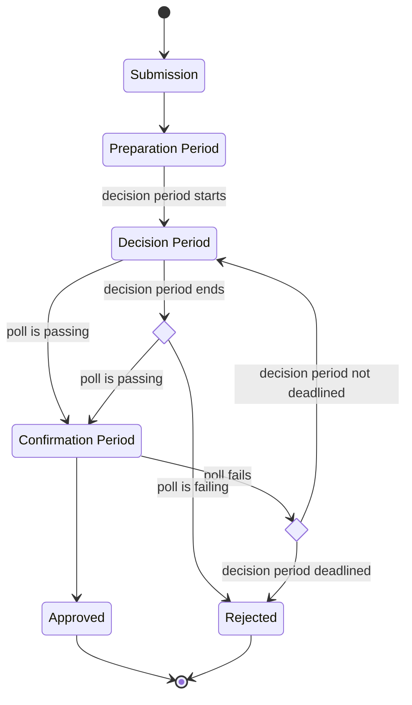
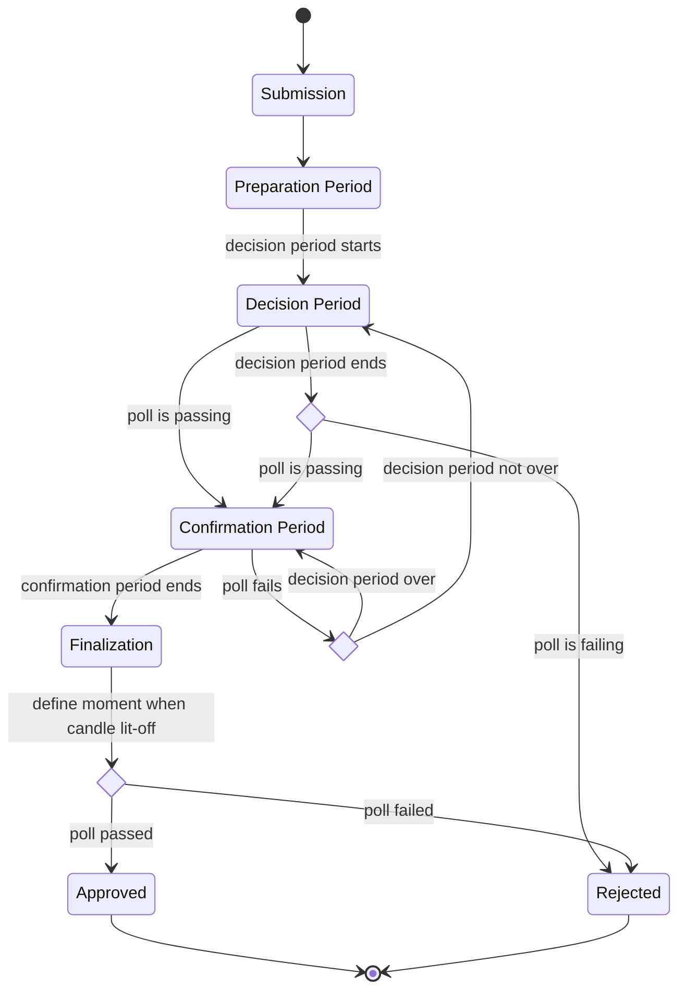

# RFC-00xx: Referenda Confirmation by Candle Mechanism

|                 |                                                                                           |
| --------------- | ----------------------------------------------------------------------------------------- |
| **Start Date**  | 22 March 2024                                                                             |
| **Description** | Proposal to decide polls after confirm period via a mechanism similar to a candle auction |
| **Authors**     | Pablo Dorado                                                                              |

## Summary

In an attempt to mitigate risks derived from unwanted behaviours around long ongoing periods on
referenda, this proposal describes how to finalize and decide a result of a poll via a
mechanism similar to candle auctions.

## Motivation

Referenda protocol provide permissionless and efficient mechanisms to enable governance actors to
decide the future of the blockchains around Polkadot network. However, they pose a series of risks
derived from the game theory perspective around these mechanisms. One of them being where an actor
uses the the public nature of the tally of a poll as a way of determining the best point in time to
alter a poll in a meaningful way.

While this behaviour is expected based on the current design of the referenda logic, given the
recent extension of ongoing times (up to 1 month), the incentives for a bad actor to cause losses
on a proposer, reflected as wasted cost of opportunity increase, and thus, this otherwise
reasonable outcome becomes an attack vector, a potential risk to mitigate, especially when such
attack can compromise critical guarantees of the protocol (such as its upgradeability).

To mitigate this, the referenda underlying mechanisms should incentive actors to cast their votes
on a poll as early as possible. This proposal's approach suggests using a Candle Auction that will
be determined right after the confirm period finishes, thus decreasing the chances of actors to
alter the results of a poll on confirming state, and instead incentivizing them to cast their votes
earlier, on deciding state.

## Stakeholders

- **Governance actors**: Tokenholders and Collectives that vote on polls that have this mechanism
  enabled should be aware this change affects the outcome of failing a poll on its confirm period.
- **Runtime Developers**: This change requires runtime developers to change configuration
  parameters for the Referenda Pallet.
- **Tooling and UI developers**: Applications that interact with referenda must update to reflect
  the new `Finalizing` state.

## Explanation

Currently, the process of a referendum/poll is defined as an sequence between an ongoing state
(where accounts can vote), comprised by a with a preparation period, a decision period, and a
confirm period. If the poll is passing before the decision period ends, it's possible to push
forward to confirm period, and still, go back in case the poll fails. Once the decision period
ends, a failure of the poll in the confirm period will lead to the poll to ultimately be rejected.

This specification proposes three changes to implement this candle mechanism:

1. This mechanism MUST be enabled via a configuration parameter. Once enabled, the referenda system
   MAY record the next poll ID from which to start enabling this mechanism. This is to preserve
   backwards compatibility with currently ongoing polls.
1. A record of the poll status (whether it is passing or not) is stored once the decision period is
   finished.
1. Including a **Finalization** period as part of the ongoing state. From this point, the poll MUST
   be immutable at this point.

   This period begins the moment after confirm period ends, and extends the decision for a couple
   of blocks, until the [VRF][wiki:vrf] seed used to determine the candle block can be considered
   _"good enough"_. This is, not known before the ongoing period (decision/confirmation) was over.

   Once that happens, a random block within the confirm period is chosen, and the decision of
   approving or rejecting the poll is based on the status immediately before the block where the
   candle was _"lit-off"_.

When enabled, the state diagram for the referenda system is the following:

## Drawbacks

This approach doesn't include a mechanism to determine whether a change of the poll status in the
confirming period is due to a legitimate change of mind of the voters, or an exploitation of its
aforementioned vulnerabilities (like a sniping attack), instead treating all of them as potential
attacks.

This is an issue that can be addressed by additional mechanisms, and heuristics that can help
determine the probability of a change of poll status to happen as a result of a legitimate behaviour.

## Testing, Security, and Privacy

The implementation of this RFC will be tested on testnets (Paseo and Westend) first. Furthermore, it
should be enabled in a canary network (like Kusama) to ensure the behaviours it is trying to address
is indeed avoided.

An audit will be required to ensure the implementation doesn't introduce unwanted side effects.

There are no privacy related concerns.

## Performance, Ergonomics, and Compatibility

### Performance

The added steps imply pessimization, necessary to meet the expected changes. An implementation MUST
exit from the **Finalization** period as early as possible to minimize this impact.

### Ergonomics

This proposal does not alter the already exposed interfaces or developers or end users. However, they
must be aware of the changes in the additional overhead the new period might incur (these depend on the
implemented VRF).

### Compatibility

This proposal does not break compatibility with existing interfaces, older versions, but it alters the
previous implementation of the referendum processing algorithm.

An acceptable upgrade strategy that can be applied is defining a point in time (block number, poll index)
from which to start applying the new mechanism, thus, not affecting the already ongoing referenda.

## Prior Art and References

- [Auctions pallet][docs:polkadot-runtime-common::auctions] in [`polkadot-runtime-commont`][crates:polkadot-runtime-common]: Defines the mechanism of candle auctions.
- **PBA Book**: A good place to read about [VRFs][pba:exotic-primitives].

## Unresolved Questions

- How to determine in a statistically meaningful way that a change in the poll status corresponds to an
  organic behaviour, and not an unwanted, malicious behaviour?

## Future Directions and Related Material

A proposed implementation of this change can be seen on this [Pull Request](https://github.com/virto-network/polkadot-sdk/pull/4).

[crates:polkadot-runtime-common]: https://crates.io/crates/polkadot-runtime-common
[docs:polkadot-runtime-common::auctions]: https://docs.rs/polkadot-runtime-common/16.0.0/polkadot_runtime_common/auctions/index.html
[pba:exotic-primitives]: https://polkadot-blockchain-academy.github.io/pba-book/cryptography/exotic-primitives/page.html?highlight=vrf#verifiable-random-functionsvrfs
[wiki:vrf]: https://en.wikipedia.org/wiki/Verifiable_random_function
