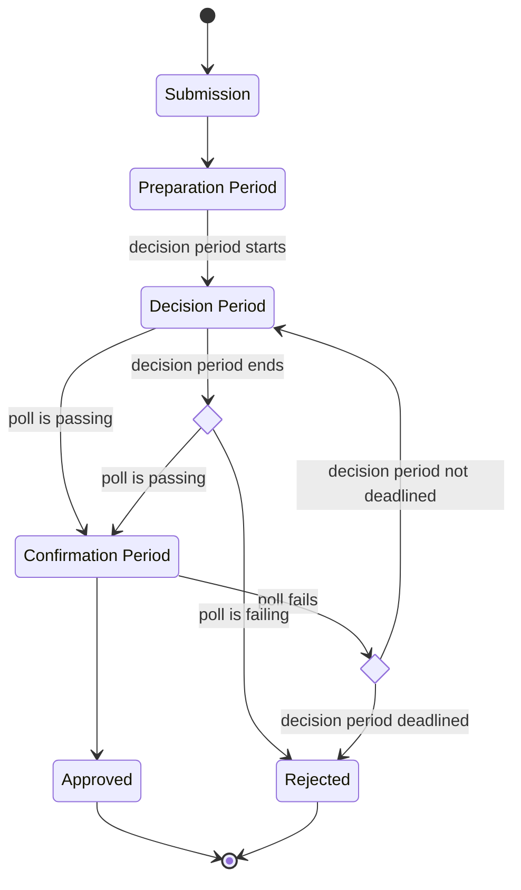

# RFC-00xx: Referenda Confirmation by Candle Auction

|                 |                                                                  |
| --------------- | ---------------------------------------------------------------- |
| **Start Date**  | 22 March 2024                                                    |
| **Description** | Proposal to decide polls after confirm period via candle auction |
| **Authors**     | Pablo Dorado                                                     |

## Summary

In an attempt to mitigate risks derived from unwanted behaviours around long ongoing periods on
referenda, this proposal describes how to finalize and decide a result of a poll via a
mechanism similar to candle auctions.

## Motivation

Referenda protocol provide permissionless and efficient mechanisms to enable governance actors to
decide the future of the blockchains around Polkadot network. However, they pose a series of risks
derived from the game theory perspective around these mechanisms. One of them being where an actor
uses the the public nature of the tally of a poll as a way of determining the best point in time to
alter a poll in a meaningful way.

While this behaviour is expected based on the current design of the referenda logic, given the
recent extension of ongoing times (up to 1 month), the incentives for a bad actor to cause losses
on a proposer, reflected as wasted cost of opportunity increase, and thus, this otherwise
reasonable outcome becomes an attack vector, a potential risk to mitigate, especially when such
attack can compromise critical guarantees of the protocol (such as its upgradeability).

To mitigate this, the referenda underlying mechanisms should incentive actors to cast their votes
on a poll as early as possible. This proposal's approach suggests using a Candle Auction that will
be determined right after the confirm period finishes, thus decreasing the chances of actors to
alter the results of a poll on confirming state, and instead incentivizing them to cast their votes
earlier, on deciding state.

## Stakeholders

- **Governance actors**: Tokenholders and Collectives that vote on polls that have this mechanism
  enabled should be aware this change affects the outcome of failing a poll on its confirm period.
- **Runtime Developers**: This change requires runtime developers to change configuration
  parameters for the Referenda Pallet.
- **Tooling and UI developers**: Applications that interact with referenda must update to reflect
  the new `Finalizing` state.

## Explanation

Currently, the process of a referendum/poll is defined as an sequence between an ongoing state
(where accounts can vote), comprised by a with a preparation period, a decision period, and a
confirm period. If the poll is passing before the decision period ends, it's possible to push
forward to confirm period, and still, go back in case the poll fails. Once the decision period
ends, a failure of the poll in the confirm period will lead to the poll to ultimately be rejected.

This specification proposes two changes to implement this candle mechanism:

1. Storing every change of the poll status (whether it is passing or not) once the decision period
   is over.
1. Including a **Finalization** period in the ongoing state. This period begins the moment after
   confirm period ends, and extends the decision for a couple of blocks, until the [VRF][wiki:vrf]
   seed used to determine the candle block can be considered _"good enough"_, this is, not known
   before the ongoing period (decision/confirmation) was over.

   After that happens, a random block within the confirm period is chosen, and the decision of
   approving or rejecting the poll is based on the status immediately before the block where the
   candle was _"lit-off"_.

This change implies ensuring the poll cannot be mutated after .

## Drawbacks

<!-- TODO: Add if any -->

## Prior Art and References

> TODO: Mention Prior Art

- `pallet-auction`

## Testing, Security, and Privacy

> TODO: Mention which testing is done (and will be added on the `polkadot-sdk` PR.

## Unresolved Questions

<!-- TODO: Add if any -->

## Future Directions and Related Material

<!-- TODO: Add if any -->

[wiki:vrf]: https://en.wikipedia.org/wiki/Verifiable_random_function
