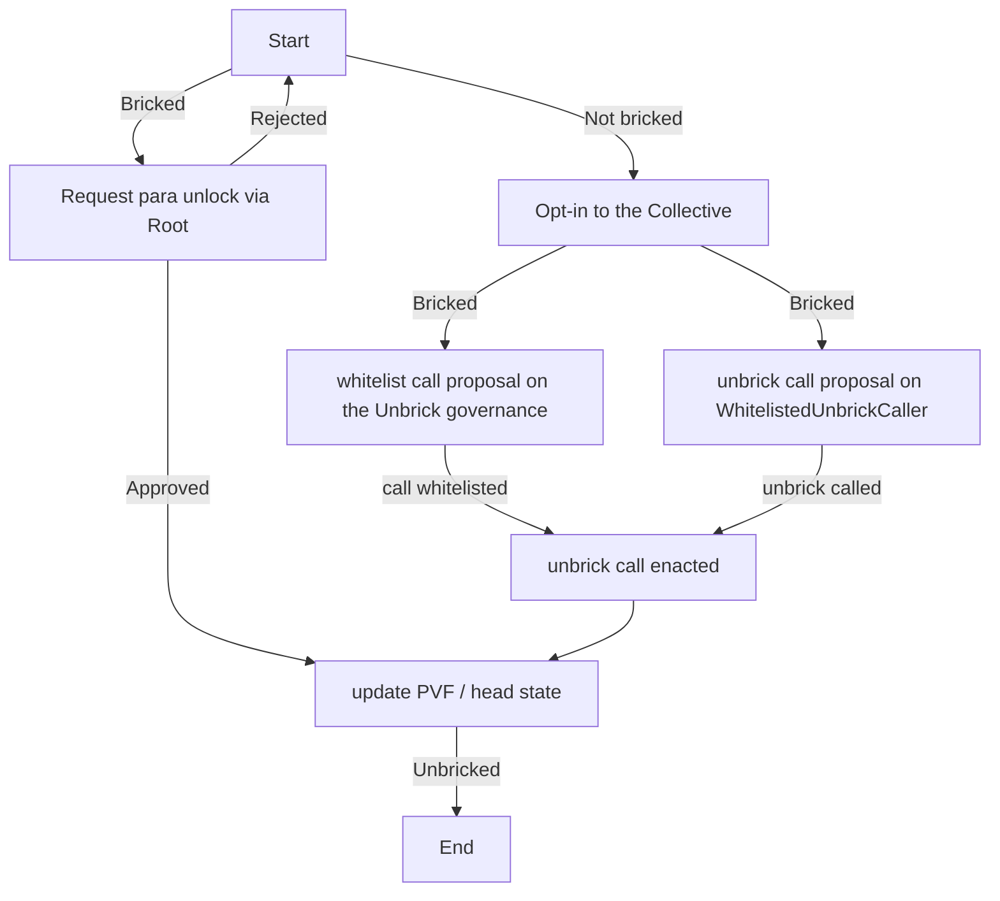

# RFC-0117: The Unbrick Collective

|                 |                                                                                          |
| --------------- | ---------------------------------------------------------------------------------------- |
| **Start Date**  | 22 August 2024                                                                           |
| **Description** | The Unbrick Collective aims to help teams rescuing a para once it stops producing blocks |
| **Authors**     | Bryan Chen, Pablo Dorado                                                                 |

## Summary

A followup of the [RFC-0014]. This RFC proposes adding a new collective to the Polkadot Collectives
Chain: The Unbrick Collective, as well as improvements in the mechanisms that will allow teams
operating paras that had stopped producing blocks to be assisted, in order to restore the production
of blocks of these paras.

## Motivation

Since the initial launch of Polkadot parachains, there has been many incidients causing parachains
to stop producing new blocks (therefore, being _bricked_) and many occurrences that requires
Polkadot governance to update the parachain head state/wasm. This can be due to many reasons range
from incorrectly registering the initial head state, inability to use sudo key, bad runtime
migration, bad weight configuration, and bugs in the development of the Polkadot SDK.

Currently, when the para is not unlocked in the _paras registrar_[^1], the `Root` origin is required to
perform such actions, involving the governance process to invoke this origin, which can be very
resource expensive for the teams. The long voting and enactment times also could result significant
damage to the parachain and users.

Finally, other instances of governance that might enact a call using the `Root` origin (like the
Polkadot Fellowship), due to the nature of their mission, are not fit to carry these kind of tasks.

In consequence, the idea of a Unbrick Collective that can provide assistance to para teams when
they brick and further protection against future halts is reasonable enough.

## Stakeholders

- Parachain teams
- Parachain users
- OpenGov users
- Polkadot Fellowship

## Explanation

### The Collective

The Unbrick Collective is defined as an unranked collective of members, not paid by the Polkadot
Treasury. Its main goal is to serve as a point of contact and assistance for enacting the actions
needed to unbrick a para. Such actions are:

- Updating the Parachain Verification Function (a.k.a. a new WASM) of a para.
- Updating the head state of a para.
- A combination of the above.

In order to ensure these changes are safe enough for the network, actions enacted by the Unbrick
Collective must be whitelisted via similar mechanisms followed by collectives like the Polkadot
Fellowship. This will prevent unintended, not overseen changes on other paras to occur.

Also, teams might opt-in to delegate handling their para in the registry to the Collective. This
allows to perform similar actions using the _paras registrar_, allowing for a shorter path to unbrick a
para.

Initially, the unbrick collective has powers similar to a parachains own sudo, but permits more
decentralized control. In the future, Polkadot shall provide functionality like SPREE or JAM that
exceeds sudo permissions, so the unbrick collective cannot modify those state roots or code.  

### The Unbrick Process

Initially, a para team has two paths to handle a potential unbrick of their para in the case it
stops producing blocks.

1. **Opt-in to the Unbrick Collective**: This is done by delegating the handling of the para
  in the _paras registrar_ to an origin related to the Collective. This doesn't require unlocking
  the para. This way, the collective is enabled to perform changes in the _paras_ module, after
  the **Unbrick Process** proceeds.
2. **Request a Para Unlock**: In case the para hasn't delegated its handling in the _paras
  registrar_, it'll be still possible for the para team to submit a proposal to unlock the para,
  which can be assisted by the Collective. However, this involves submitting a proposal to the `Root`
  governance origin.

### Belonging to the Collective

The collective will be initially created without members (no seeding). There will be additional
governance proposals to setup the seed members.

The origins able to modify the members of the collective are:

- The `Fellows` track in the Polkadot Fellowship.
- `Root` track in the Relay.
- More than two thrids of the existing Unbrick Collective.

The members are responsible to verify the technical details of the unbrick requests (i.e. the hash
of the new PVF being set). Therefore, they must have the technical capacity to perform such tasks.

Suggested requirements to become a member are the following:

- Rank 3 or above in the Polkadot Fellowship.
- Being a CTO or Technical Lead in a para team that has opted-in to delegate the Unbrick Collective
  to manage the PVF/head state of the para.

## Drawbacks

The ability to modify the Head State and/or the PVF of a para means a possibility to perform
arbitrary modifications of it (i.e. take control the native parachain token or any bridged assets
in the para).

This could introduce a new attack vectorm, and therefore, such great power needs to be handled
carefully.

## Testing, Security, and Privacy

The implementation of this RFC will be tested on testnets (Rococo and Westend) first.

An audit will be required to ensure the implementation doesn't introduce unwanted side effects.

There are no privacy related concerns.

## Performance, Ergonomics, and Compatibility

### Performance

This RFC should not introduce any performance impact.

### Ergonomics

This RFC should improve the experience for new and existing parachain teams, lowering the barrier
to unbrick a stalled para.

### Compatibility

This RFC is fully compatible with existing interfaces.

## Prior Art and References

- [RFC-0014: Improve Locking Mechanisms for Parachains][RFC-0014]
- [How to Recover a Parachain, Polkadot Forum][forum:673]
- [Unbrick Collective, Polkadot Forum][forum:6931]

## Unresolved Questions

- What are the parameters for the `WhitelistedUnbrickCaller` track?
- Any other methods that shall be updated to accept `Unbrick` origin?
- Any other requirements to become a member?
- We would like to keep this simple, so no funding support from the Polkadot treasury. But do we
  want to compensate the members somehow? i.e. Allow parachain teams to donate to the collective.
- We hope SPREE/JAM would be carefully audited for miss-use risks before being  
  provided to parachain teams, but could the unbrick collective have an elections  
  that warranted trust beyond sudo powers?
- An auditing framework/collective makes sense parachain code upgrades, but  
   could also strengthen the unbrick collective.  
- Do we want to have this collective offer additional technical support to help bricked parachains?
  i.e. help debug the code, create the rescue plan, create postmortem report, provide resources on
  how to avoid getting bricked

<!-- Footnotes -->

[^1]: The _paras registrar_ refers to a pallet in the Relay, responsible to gather registration info
of the paras, the locked/unlocked state, and the manager info.

<!-- Links -->

[RFC-0014]: ./0014-improve-locking-mechanism-for-parachains
[forum:673]: https://forum.polkadot.network/t/how-to-recover-a-parachain/673
[forum:6931]: https://forum.polkadot.network/t/unbrick-collective/6931
